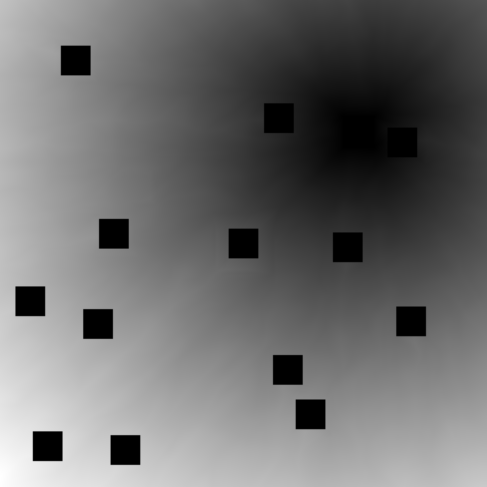

# DIJKSTRA

Pathfinding challenge: cities are placed in the lowest cost location on the map (grayscale terrain taken from NASA image of mars). Cheapest paths are drawn from a given city to all other cities.

Location of cities are shown in cities.png, while the costs for the selected city are shown in costs.png

## Final paths:

## Location of cities:

## Path cost map calculated from selected city:

